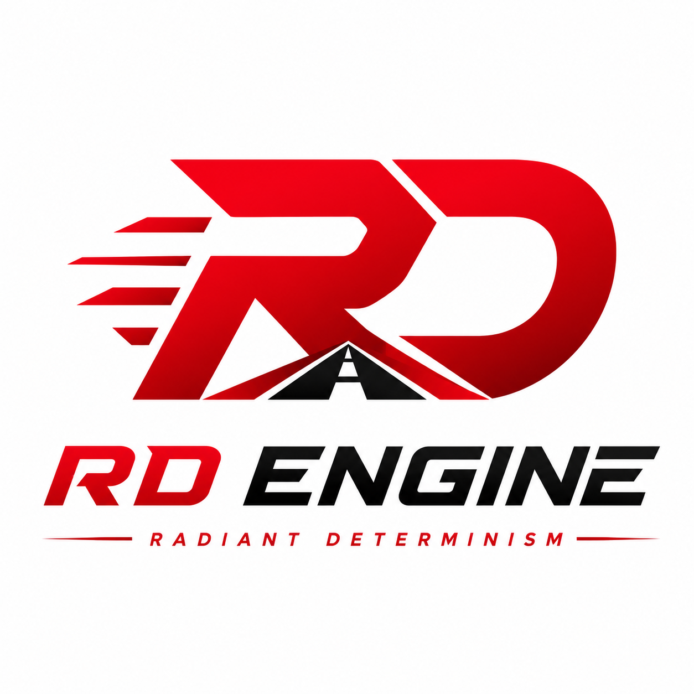
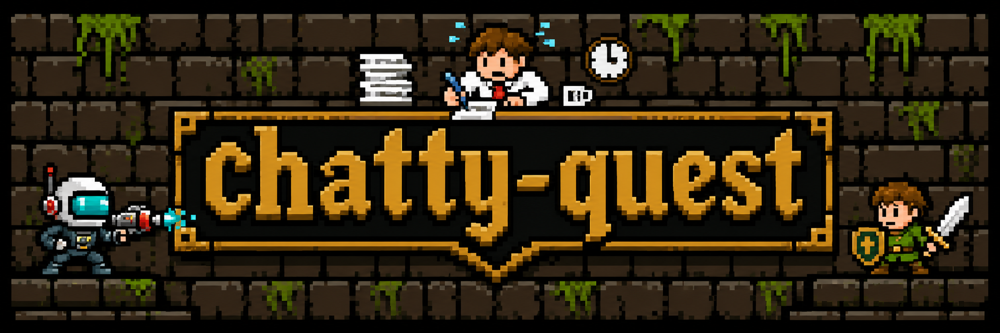
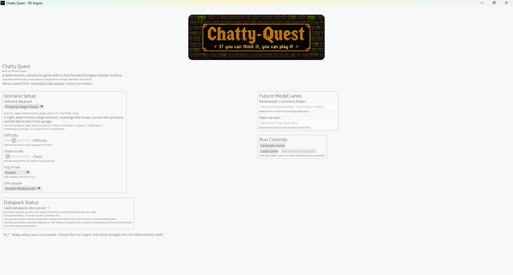
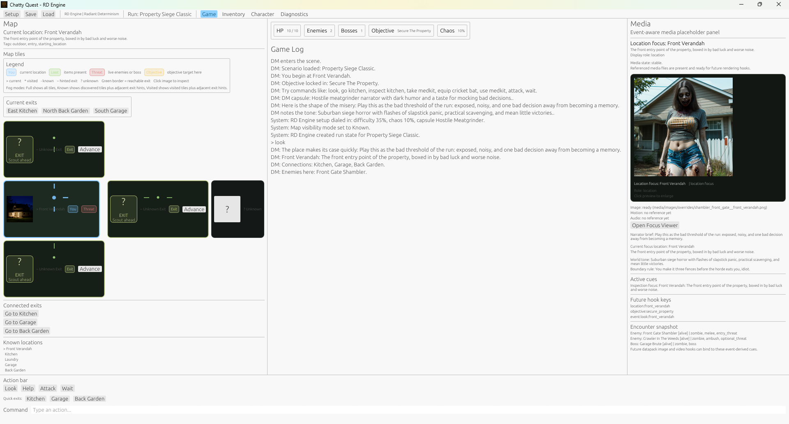
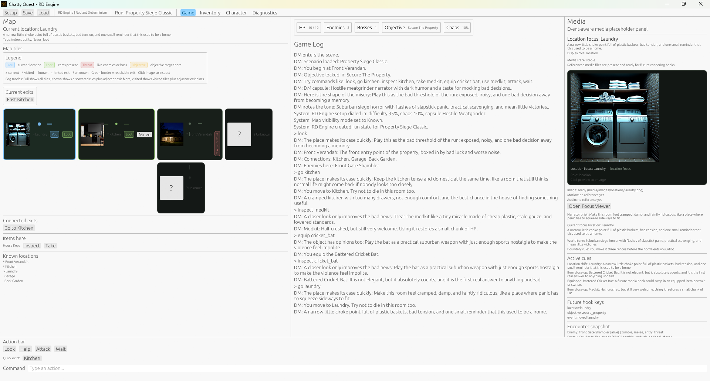
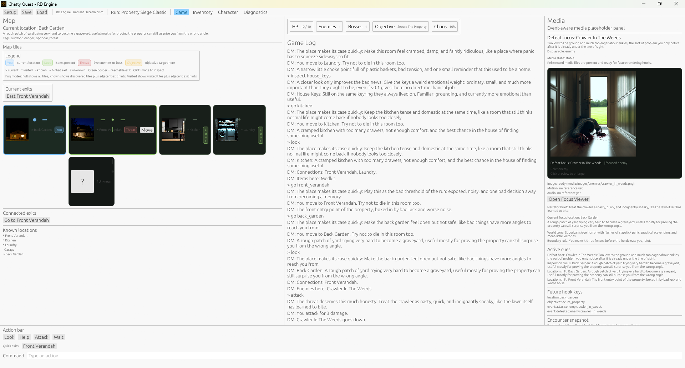
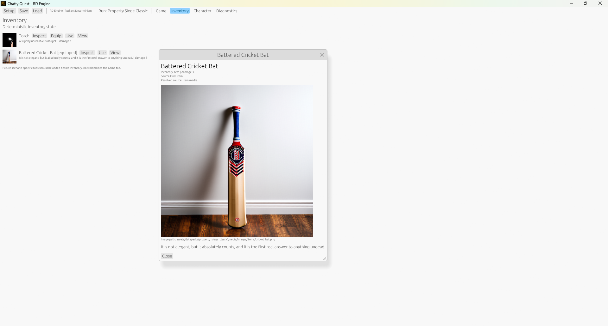

# Chatty Quest

Chatty Quest is the first game built on the `RD Engine`, the `Radiant Determinism Engine`.

The short version:

- templates are the nouns
- buckets are the current grammar
- reducers are the verbs
- narration is the accent
- media is the illustration

Chatty Quest is a Rust desktop adventure engine where deterministic templates and bucketed state create the world, while a narrator layer presents that world as a chat-forward Dungeon Master experience.

`Radiant Determinism` means the experience can feel dynamic, reactive, funny, and alive, while every meaningful gameplay payoff is grounded in deterministic state, reducer-confirmed mutations, and visible UI updates.

Current release status:

- `v0.1` is accepted
- the desktop `egui/eframe` shell is playable end-to-end
- datapack discovery, deterministic run generation, reducer actions, `MockNarrator`, media focus, diagnostics, and JSON save/load are all wired and working
- `cargo test` currently passes with `14` automated tests
- the live manual sweep passed on `2026-06-11`

`v0.1` is focused on one playable scenario pack:

- `Property Siege Classic`

The goal is to prove:

- datapack-driven scenario loading
- deterministic run state
- reducer-owned game truth
- a replaceable narrator seam
- save/load reliability

## Screenshot Tour

Main menu and setup shell:

Active run examples:

| Front Verandah | Laundry |
| --- | --- |
|  |  |

| Crawler encounter | Inventory tab |
| --- | --- |
|  |  |

Release and verification docs:

- [docs/V0_1_RELEASE_NOTES.md](docs/V0_1_RELEASE_NOTES.md)
- [docs/V0_1_ACCEPTANCE_AUDIT.md](docs/V0_1_ACCEPTANCE_AUDIT.md)
- [docs/V0_1_MANUAL_SWEEP.md](docs/V0_1_MANUAL_SWEEP.md)

Media credit:

- in-game media for this release was created with help from [instance001/chatty-art](https://github.com/instance001/chatty-art)

Core project docs:

- [docs/DESIGN_INTENT.md](docs/DESIGN_INTENT.md)
- [docs/PROJECT_OVERVIEW.md](docs/PROJECT_OVERVIEW.md)
- [docs/RD_ENGINE_PRINCIPLES.md](docs/RD_ENGINE_PRINCIPLES.md)
- [docs/ARCHITECTURE.md](docs/ARCHITECTURE.md)
- [docs/IMPLEMENTATION_ROADMAP.md](docs/IMPLEMENTATION_ROADMAP.md)
- [docs/UI_SHELL_SPEC.md](docs/UI_SHELL_SPEC.md)

Next-planning handoff:

- [docs/V0_2_MILESTONE_PLAN.md](docs/V0_2_MILESTONE_PLAN.md)

Branding art used by the app and docs lives under [`assets/ui/branding/`](assets/ui/branding/).

Captured app screenshots for docs and release use live under [`assets/ui/screenshots/`](assets/ui/screenshots/).

## License

Chatty Quest is licensed under the GNU Affero General Public License v3.0.

See [LICENSE](LICENSE) for details.
